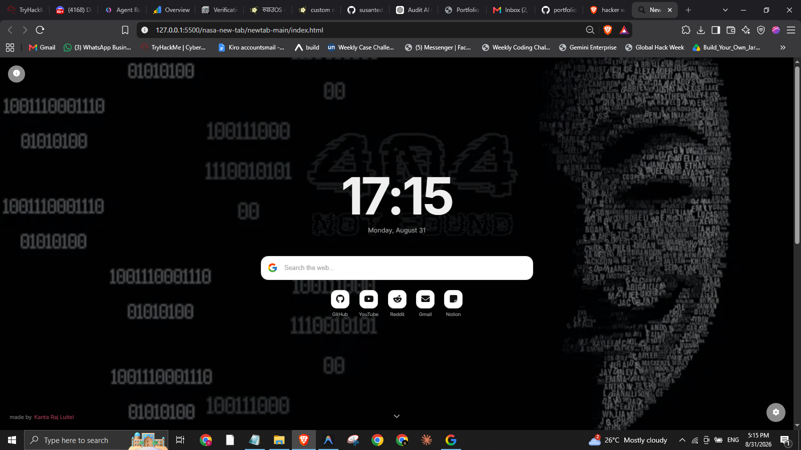

# newtab

A minimalistic, clean, and modern custom new tab page that dynamically fetches its background from NASA's Astronomy Picture of the Day (APOD) API.

## Description

Get rid of your boring, default new tab page. **newtab** provides modern aesthetics, glassmorphic design, and daily cosmic views directly from NASA's APOD.

### Features
- 🌌 **NASA APOD Backgrounds**: High-resolution daily space wallpapers with quick info link.
- 🔍 **Multi-Engine Search**: Fast switching between Google, DuckDuckGo, Brave, and Startpage.
-  **Categorized News Feed**: Real-time headlines across General, Tech, Science, Business, Sports, and Entertainment.
- **Dark & Light Modes**: Seamless theme switching with localStorage persistence.
- **Custom Accent Colors**: 5 vibrant accent themes to personalize your workspace.
-  **Quick Access Favorites**: One-click bookmarks for daily essentials.
-  **Keyboard Driven**: Quick search triggers and navigation shortcuts.

---

##  Keyboard Shortcuts

| Shortcut | Action |
| :--- | :--- |
| `Ctrl + K` or `Cmd + K` | Focus and select search bar |
| `/` | Quick focus search bar |
| `Enter` | Search with selected engine |
| `Esc` | Clear search input & blur |

---

##  Built With

- **HTML5** & Semantic Markup
- **CSS3** (Glassmorphism, Flexbox/Grid, CSS Custom Properties)
- **JavaScript (ES6+)**
- **APIs**:
  - [NASA APOD API](https://apod.nasa.gov/apod/astropix.html)
  - [GNews API](https://gnews.io/)

---

##  Browser Support

Works seamlessly across all modern browsers: Chrome, Edge, Firefox, Brave, Arc, Opera, and Safari.

---

- made with  by <b>Kanta Raj Luitel</b>
