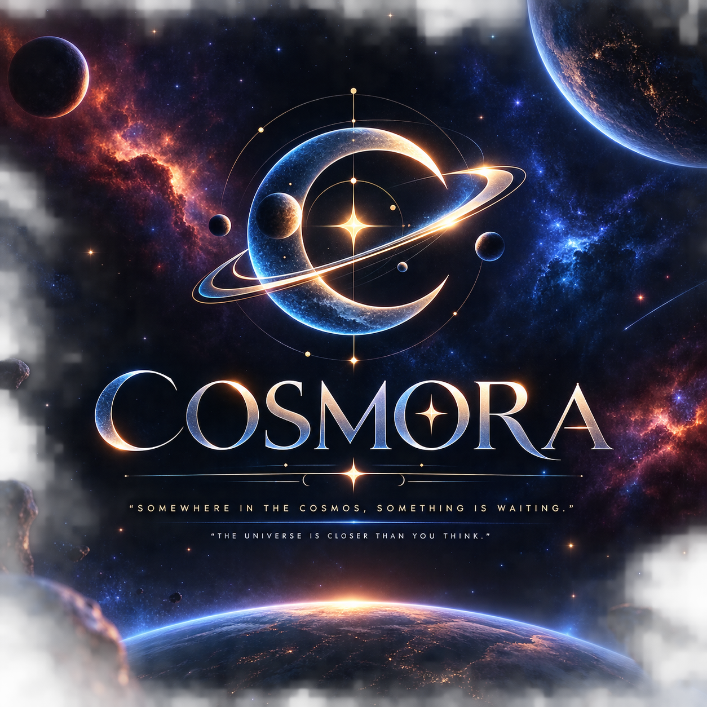

<div align="center">
  
  <h1>🪐 COSMORA</h1>
  <h3>Deep Space Astronomical Observation Console & Minimal New Tab Dashboard</h3>
  <p><em>"Somewhere in the cosmos, something is waiting."</em> — Carl Sagan</p>
  <p><em>"The universe is closer than you think."</em></p>

  <br>

  [](https://stardance.hackclub.com/missions/nasa-page)
  [](https://vitejs.dev/)
  [](https://api.nasa.gov/)
  [](./LICENSE)
</div>

---

## 🌌 Overview

**COSMORA** is an astronomical new tab dashboard and deep-space observation workstation built for the **[Hack Club Stardance Mission](https://stardance.hackclub.com/missions/nasa-page)**.

Instead of opening a plain browser new tab, **COSMORA** transforms your screen into a spacecraft observation deck looking into deep space. It brings together NASA's Astronomy Picture of the Day (APOD), full-bleed 3D CSS planetary orbits, real-time mathematical lunar ephemeris, live ISS telemetry tracking, developer quick-launch shortcuts, interactive task managers, and auto-saving scratchpads into one unified interface.

---

## ✨ Key Features

### 1. 🪐 Minimal New Tab Dashboard (`HOME`)
- **Centerpiece Digital Clock**: Large clock with automatic local date resolution and subtle cosmic gradient glow.
- **Google Universal Search Bar**: Quick launcher search input with keyboard shortcut focus (`/`).
- **6-Card Interactive Bento Grid**:
  1. **Daily APOD Discovery**: Live photo preview, title, explanation excerpt, and one-click jump to full transmission.
  2. **Quick Launcher Shortcuts**: Preloaded with GitHub, LinkedIn, Donate, NASA APOD, Hack Club, ChatGPT, YouTube, and X, plus a modal launcher to add custom URLs.
  3. **Mission Task Tracker**: Interactive to-do list with persistent completion states in `localStorage`.
  4. **Lunar Ephemeris & Moon Phases**: Real-time synodic lunar calculation, illumination %, lunar age in days, next full moon countdown, and dawn/dusk times with dynamic SVG shadow curve rendering.
  5. **ISS Orbit & Space Weather Telemetry**: Real-time simulated ISS orbital speed (~27,580 km/h), altitude (~418.6 km), coordinates, Geomagnetic Kp-index, and solar wind flux.
  6. **Cosmic Scratchpad & Notes**: Developer quick scratchpad with instant `localStorage` auto-saving, character & word counters, and one-click clipboard copying.

### 2. 🚀 Daily NASA APOD Transmission (`TODAY`)
- Real-time fetching from NASA's official Astronomy Picture of the Day API.
- Support for ultra-high-resolution images, full-bleed interactive pinch/zoom previews, and embedded YouTube/HTML5 videos.
- Dedicated Mission Telemetry Log sidebar with copyright attribution, technical metadata, and educational astronomy explanations written by professional astrophysicists.

### 3. 📅 Deep Space Archive Explorer (`ARCHIVE`)
- Interactive date selector allowing users to time-travel back to any day in astronomical history since NASA APOD's inception on **June 16, 1995**.
- Intelligent caching layer to ensure instant retrieval and zero redundant API calls.

### 4. 🌌 Full-Bleed 3D Planetary Orbits (`3D ORBITS`)
- Integrated 3D CSS Solar System simulation spanning full viewport width (`100vw`).
- Real-time planetary revolution velocities, custom orbital planes, celestial rings, and lighting.
- Interactive controls for 2D/3D perspective, zoom scaling, orbital speed, physical sizes, and planetary distances.

### 5. 🔊 Ambient Deep Space Synthesizer
- Built-in Web Audio API dual-oscillator ambient sound engine (55Hz sub-bass sine + 110Hz triangle wave through a 220Hz lowpass filter).
- Smooth gain ramping and volume fade-in/fade-out simulating deep-space radio emissions and cosmic background radiation.

### 6. 🎨 Celestial Typography & Design System
- **Cinzel** (600/700): Celestial, monumental major headings and COSMORA wordmark.
- **Cormorant Garamond** (Italic 400–600): Poetic statements, cinematic quotes, and editorial introductions.
- **Manrope** (400–700): Modern, usable UI text, buttons, forms, and metadata labels.
- **Zero Emojis**: 100% resolution-independent, crisp inline SVG vector icons.

---

## 🛠️ Tech Stack & Architecture

| Layer | Technology |
| :--- | :--- |
| **Frontend Framework** | Vanilla HTML5, Vanilla JavaScript (ES Modules) |
| **Styling & Design** | Vanilla CSS3 (Custom Glassmorphism Design System, CSS Grid Bento, Flexbox) |
| **Typography** | Google Fonts (`Cinzel`, `Cormorant Garamond`, `Manrope`) |
| **Bundler & Build Tool** | [Vite 5](https://vitejs.dev/) |
| **APIs** | [NASA Open Data API](https://api.nasa.gov/) (`APOD`) |
| **Audio Engine** | Native Web Audio API (Dual-Oscillator Synthesizer) |
| **Graphics & Background** | HTML5 Canvas Dynamic Multilayer Particle Starfield & CSS Nebula |
| **Hosting & CI/CD** | Vercel & GitHub Actions (`deploy.yml`) |

---

## 🚀 Getting Started Locally

### Prerequisites
- [Node.js](https://nodejs.org/) (version 18 or higher recommended)
- [npm](https://www.npmjs.com/)

### 1. Clone the Repository
```bash
git clone https://github.com/susantedit/Hack-club-stardance-Give-Your-Website-a-Pulse-.git
cd Hack-club-stardance-Give-Your-Website-a-Pulse-
```

### 2. Install Dependencies
```bash
npm install
```

### 3. Setup Environment Variables
Copy the example environment file and add your NASA API key (optional, fallback `DEMO_KEY` is provided):
```bash
cp .env.example .env
```
Inside `.env`:
```ini
VITE_NASA_API_KEY=YOUR_NASA_API_KEY_HERE
```
*(Get a free API key at [api.nasa.gov](https://api.nasa.gov/))*

### 4. Start Development Server
```bash
npm run dev
```
Open your browser and navigate to `http://localhost:5173`.

### 5. Build for Production
```bash
npm run build
```
The optimized production bundle will be generated in the `dist/` directory.

---

## 🌐 Deploying to Vercel

1. Push your code to GitHub.
2. Go to **[vercel.com](https://vercel.com)** and click **"Add New Project"**.
3. Import this repository (`susantedit/Hack-club-stardance-Give-Your-Website-a-Pulse-`).
4. Set the **Project Name** to `cosmora`.
5. Keep default build settings:
   - **Framework Preset**: `Vite`
   - **Build Command**: `npm run build`
   - **Output Directory**: `dist`
6. Click **Deploy**!

---

## 👨‍💻 Author

**Kantaraj Luitel (Susant)**
- GitHub: [@susantedit](https://github.com/susantedit)
- LinkedIn: [kantaraj-luitel](https://linkedin.com/in/kantaraj-luitel)

---

## 📄 License

This project is licensed under the **MIT License** — see the [LICENSE](./LICENSE) file for details.

---

<div align="center">
  <p>Built with ❤️ for the <strong>Hack Club Stardance Mission</strong>.</p>
  <p><em>COSMIC OBSERVER v2.0 • POWERED BY NASA APOD API</em></p>
</div>
